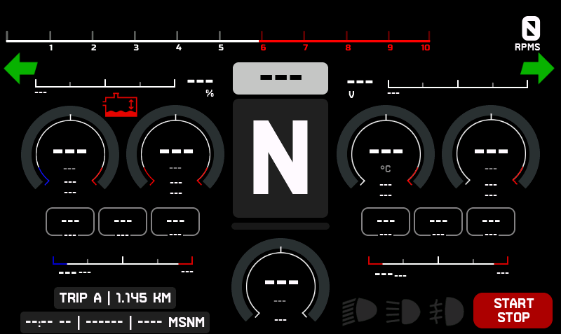
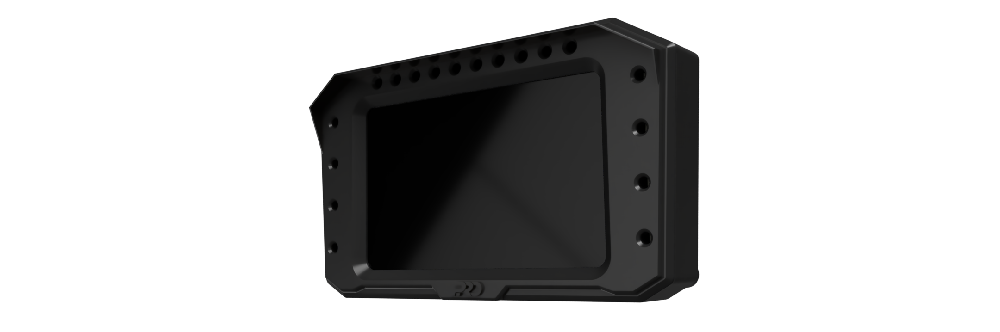

# ADV.dash

ADV.dash is a dashboard project built with **LVGL** and **ESP32-S3**.  
It is prepared to receive CAN bus data from **rusEFI** and, in the future, other programmable ECUs.

## Requirements
- PlatformIO
- ESP32-S3 DevKitC-1 board (1.5-inch display)
- LVGL library
- rusEFI CAN bus setup

## Compilation Steps
1. Clone the repository:
   ```bash
   git clone https://github.com/ADVecu/ADV.dash.git
   ```
2. Open the project in **PlatformIO**.
3. Copy the file `esp32-s3-devkitc-1-5inch` to the **boards** directory of the **Espressif** platform in PlatformIO.
4. Copy `lv_conf.h` to its correct LVGL configuration folder.
5. Build and upload the project to your ESP32-S3.

## Images



---
